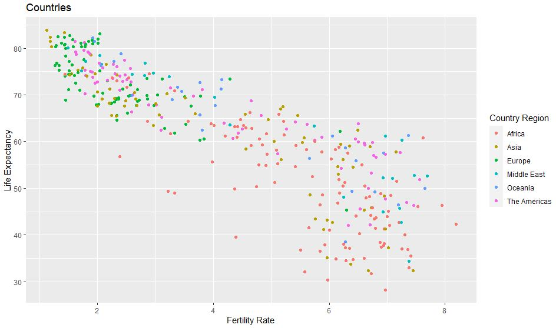
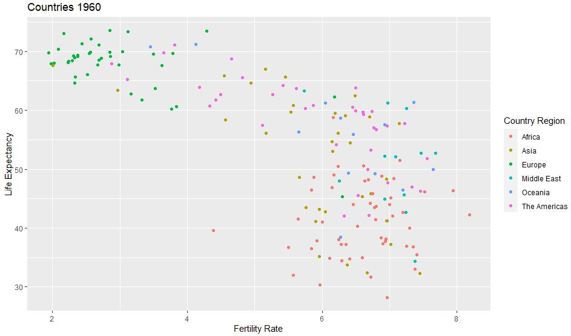
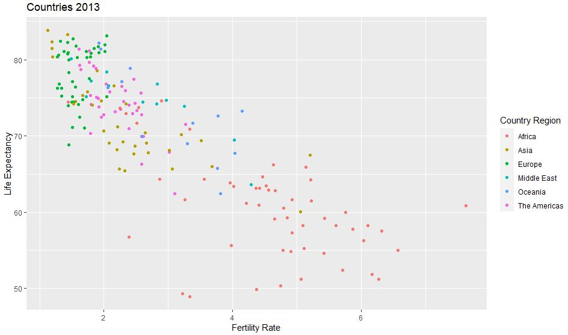

# Assessment 1

#### The World Bank was very impressed with your delivery of the previous assignment and they have a new project for you.

#### The World Bank was very impressed with your delivery on the previous assignment and they have a new project for you. You must generate a scatter-plot showing the statistics of life expectancy (Life expectancy - y-axis) and fertility rate (Fertility Rate -x-axis) by country (Country). The scatterplot should also be classified by Country Regions.

#### We extreme the file browser data and create a new vector with the 1960 and 2013 life expectancy data. Finally a new data frame is created with a new column for the life expectancy.

```r
df <- read.csv(file.choose())
y <- c(Life_Expectancy_At_Birth_1960, Life_Expectancy_At_Birth_2013)
df["Life.expectancy"] <- y
```

We create new data frames to visualize the scatterplots for the dates of 1960 and 2013. First the records with the specific dates are filtered.

```r
df_2 <- df$Year == "1960"
df_3 <- df$Year == "2013"
df_1960 = df[df_2,]
df_2013 = df[df_3,]

```

The library is exported to create graphs

```r
library(ggplot2)
```

The values for "x" and "y" of the data frame created are determined to visually see the dispersion of the total set with their respective titles.

```r
ggplot(
df,
aes(x=df$Fertility.Rate, y=df$Life.expectancy, colour=df$Region)) +
geom_point() +
labs(title="Countries", x="Fertility Rate", y="Life Expectancy", colour="Country Region")
```



#### You have been provided data for 2 years: 1960 and 2013 and you are required to produce a visualization for each of these years.

In the same way as the previous one, the data frame created from the year 1960 is used.

```r
ggplot(
df_1960,
aes(x=df_1960$Fertility.Rate, y=df_1960$Life.expectancy, colour=df_1960$Region)) +
geom_point() +
labs(title="Countries 1960", x="Fertility Rate", y="Life Expectancy", colour="Country Region")
```



In the same way as the previous one, the data frame created from the year 2013 is used.

```r
ggplot(
df_2013,
aes(x=df_2013$Fertility.Rate, y=df_2013$Life.expectancy, colour=df_2013$Region)) +
geom_point() +
labs(title="Countries 2013", x="Fertility Rate", y="Life Expectancy", colour="Country Region")
```



As we can see in the 1960 plot, Europe have the most countries with higher life expectancy, but at the same time the lowest fertility rate.
In the other hand, Africa have the most countries with lower life expectancy, but higher fertility rate, so we can say it might be a correlation.

Looking at the 2013 plot, Europe still at the top of life expectancy but some Asian countries are at the top too.
Africa still looks the same, lowest life expectancy and highest fertility rate.
Overall in 2013 the average life expectancy increased but fertility rate decreased in some cases.
