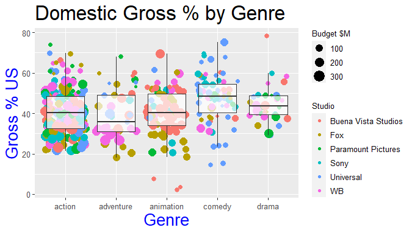

# Test 1

#### The CSV data is declared in a variable

```r
setwd("E:/Programas TEC/TEC/Mineria de datos/Practicas/Flores_Practicas/Unit 2/Test")
getwd()
movies <- read.csv("Project-Data.csv")
head(movies)
```

Result:

```r
> head(movies)
  Day.of.Week                Director  Genre       Movie.Title Release.Date              Studio
1      Friday               Brad Bird action      Tomorrowland   22/05/2015 Buena Vista Studios
2      Friday             Scott Waugh action    Need for Speed   14/03/2014 Buena Vista Studios
3      Friday          Patrick Hughes action The Expendables 3   15/08/2014           Lionsgate
4      Friday Phil Lord, Chris Miller comedy    21 Jump Street   16/03/2012                Sony
5      Friday         Roland Emmerich action  White House Down   28/06/2013                Sony
6      Friday              David Ayer action              Fury   17/10/2014                Sony
  Adjusted.Gross...mill. Budget...mill. Gross...mill. IMDb.Rating MovieLens.Rating Overseas...mill.
1                  202.1            170         202.1         6.7             3.26            111.9
2                  204.2             66         203.3         6.6             2.97            159.7
3                  207.1            100         206.2         6.1             2.93            166.9
4                  208.8             42         201.6         7.2             3.62             63.1
5                  209.7            150         205.4         8.0             3.65            132.3
6                  212.8             80         211.8         5.8             2.85              126
  Overseas. Profit...mill. Profit. Runtime..min. US...mill. Gross...US
1      55.4           32.1    18.9           130       90.2       44.6
2      78.6          137.3   208.0           132       43.6       21.4
3      80.9          106.2   106.2           126       39.3       19.1
4      31.3          159.6   380.0           109      138.4       68.7
5      64.4           55.4    36.9           131       73.1       35.6
6      59.5          131.8   164.8           134       85.8       40.5
```

#### The columns are renamed to better define the names

```r
colnames(movies) <- c("DayofWeek","Director","Genre","MovieTitle",
                      "ReleaseDate","Studio","AdjustedGrossinMillions",
                      "BudgetinMillions","GrossinMillions","IMDBRating",
                      "MovieLensRating","OverseasinMillions","OverseasPercent",
                      "ProfitinMillions","ProfitPercent","RuntimeinMin",
                      "USinMillions","GrossPercentUS")
```

#### Change studio and genre from character to factors

```r
movies$Studio <- factor(movies$Studio)
movies$Genre <- factor(movies$Genre)
```

#### We filter the specific genres of the movies

```r
movies_filter <- (movies$Genre=="action") | (movies$Genre=="adventure")|
  (movies$Genre=="animation") | (movies$Genre == "comedy") |
  (movies$Genre == "drama")
movies_filter
```

#### We filter specific movie studios

```r
movies_filter2 <- (movies$Studio=="Buena Vista Studios") | (movies$Studio=="Fox")|
  (movies$Studio=="Paramount Pictures") | (movies$Studio=="Sony") |
  (movies$Studio=="Universal") | (movies$Studio=="WB")
movies_filter2
```

#### A variable is declared to join the variables that contain the genre and study filters

```r
movies_filtered <- movies[movies_filter & movies_filter2,]
head(movies_filtered)
```

Result:

```r
> head(movies_filtered)
  DayofWeek                Director     Genre       MovieTitle ReleaseDate              Studio
1    Friday               Brad Bird    action     Tomorrowland  22/05/2015 Buena Vista Studios
2    Friday             Scott Waugh    action   Need for Speed  14/03/2014 Buena Vista Studios
4    Friday Phil Lord, Chris Miller    comedy   21 Jump Street  16/03/2012                Sony
5    Friday         Roland Emmerich    action White House Down  28/06/2013                Sony
6    Friday              David Ayer    action             Fury  17/10/2014                Sony
7  Thursday            Rob Marshall adventure   Into the Woods  25/12/2014 Buena Vista Studios
  AdjustedGrossinMillions BudgetinMillions GrossinMillions IMDBRating MovieLensRating
1                   202.1              170           202.1        6.7            3.26
2                   204.2               66           203.3        6.6            2.97
4                   208.8               42           201.6        7.2            3.62
5                   209.7              150           205.4        8.0            3.65
6                   212.8               80           211.8        5.8            2.85
7                   213.9               50           212.9        6.0            3.16
  OverseasinMillions OverseasPercent ProfitinMillions ProfitPercent RuntimeinMin USinMillions
1              111.9            55.4             32.1          18.9          130         90.2
2              159.7            78.6            137.3         208.0          132         43.6
4               63.1            31.3            159.6         380.0          109        138.4
5              132.3            64.4             55.4          36.9          131         73.1
6                126            59.5            131.8         164.8          134         85.8
7               84.9            39.9            162.9         325.8          125        128.0
  GrossPercentUS
1           44.6
2           21.4
4           68.7
5           35.6
6           40.5
7           60.1
```

#### The display library is initialized

```r
library(ggplot2)
```

#### It is initialized from the data of the filtered movies, as well as the variable "X" with the genre and "Y" for the gross percentage

```r
w <- ggplot(data=movies_filtered,aes(x=Genre, y=GrossPercentUS))
```

#### Components of the graph are changed so that it is the same as the previous image of the exam

```r
w <- w + geom_jitter(aes(size=BudgetinMillions,colour=Studio))+
  ylab("Gross % US")+
  ggtitle("Domestic Gross % by Genre") +
  geom_boxplot(alpha=0.7,outlier.colour=NA) +
  theme(
    axis.title.x = element_text(colour="Blue",size=20),
    axis.title.y = element_text(colour="Blue",size=20),
    axis.text.x=element_text(size=10),
    axis.text.y=element_text(size=10),
    plot.title=element_text(size=25),
    legend.title=element_text(size=10),
    legend.text=element_text(size=10),
    text=element_text(family="Comic Sans MS")
  )

w$labels$size <- "Budget $M"
w
```

Result:

