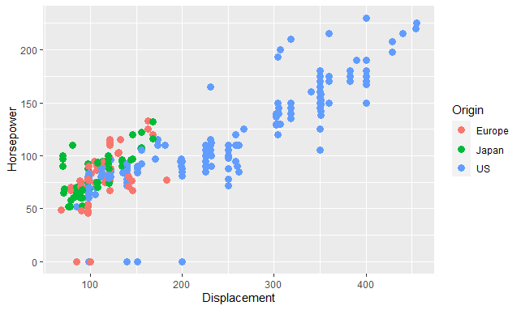
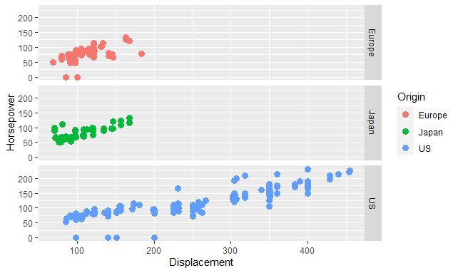
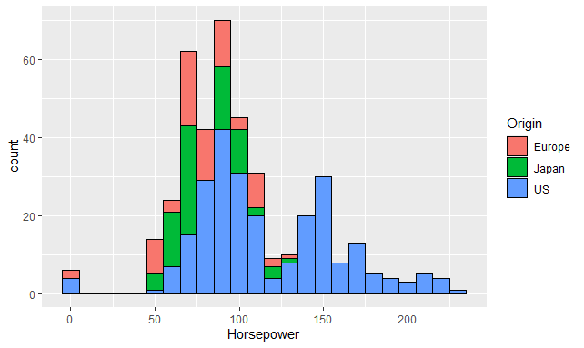
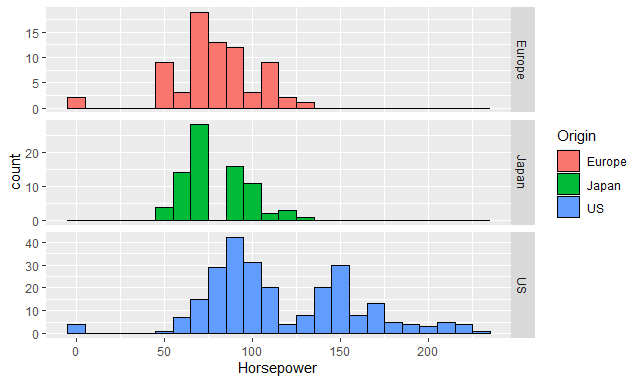

# Practice #01

1. Search for a data source with csv format (Free theme)
   Cars from "Project datasets"
2. Read the csv and analyze the data with R
3. Generate three graphs with R that tell the story of the data, the first that is a scatter plot of points, the second that is a facet graph and the third a graph that tells us something statistical such as the distribution of the data and containing the theme layer.

This practice should be documented in its respective branch (branch) of your working repository on github

### 1. Search for a data source with csv format

Cars from "[Project datasets](https://perso.telecom-paristech.fr/eagan/class/igr204/datasets)"

### 2. Read the csv and analyze the data with R

We define the path of the csv file which will be initialized in a variable with the read.csv method and the name of the columns is defined.

```r
setwd("E:/Programas TEC/TEC/Mineria de datos/Practicas/Flores_Practicas/Unit 2/Practica 1")
getwd()
cars <- read.csv("cars.csv")
colnames(cars) <- c("Car", "MPG", "Cylinders" ,"Displacement", "Horsepower", "Weight" ,"Acceleration", "Model" ,"Origin")
head(cars)

> head(cars)

                        Car MPG Cylinders Displacement Horsepower Weight Acceleration Model Origin
1 Chevrolet Chevelle Malibu  18         8          307        130   3504         12.0    70     US
2         Buick Skylark 320  15         8          350        165   3693         11.5    70     US
3        Plymouth Satellite  18         8          318        150   3436         11.0    70     US
4             AMC Rebel SST  16         8          304        150   3433         12.0    70     US
5               Ford Torino  17         8          302        140   3449         10.5    70     US
6          Ford Galaxie 500  15         8          429        198   4341         10.0    70     US
```

### 3.1. Generate three graphs with R that tell the story of the data, the first that is a scatter plot of points.

For this graph we define the variable of "x" with displacement and "y" with horsepower. Where the relationship is shown that the greater the horsepower, the greater the amount of displacement.

```r
#Scatterplots:
w <- ggplot(cars, aes(x=Displacement, y=Horsepower, color=Origin))
w + geom_point(size=3)
```



```r
w + geom_point(size=3) + facet_grid(Origin~.)
```



### 3.2. The second that is a facet graph

For this graph, the variable of the "x" is defined with the horsepower and the amount that each of the cars has, showing how US cars tend to have more horsepower than Europeans and Japanese.

```r
#Facets:
v <- ggplot(cars, aes(x=Horsepower))
v + geom_histogram(binwidth = 10, aes(fill=Origin),color="Black")
```



```r
v + geom_histogram(binwidth = 10, aes(fill=Origin),color="Black") + facet_grid(Origin~., scales="free")
```



### 3.3. The third a graph that tells us something statistical such as the distribution of the data and containing the theme layer.
```r
#theme
o <- ggplot(cars, aes(x=Horsepower))
h <- o + geom_histogram(binwidth = 10, aes(fill=Acceleration), color="Black")

h

h +
  xlab("Horsepower (HP)") +
  ylab("Count") +
  ggtitle("Distribution") +
  theme(axis.title.x = element_text(color = "Green", size=30),
        axis.title.y = element_text(color = "Blue", size=30),
        axis.text.x = element_text(size = 20),
        axis.text.y = element_text(size = 20),
        legend.title = element_text(size = 30),
        legend.text = element_text(size = 20),
        legend.position = c(1,1),
        legend.justification = c(1,1),
        plot.title = element_text(color = "DarkBlue",
                                  size = 25,
                                  family = "Courier"))
        
h
```
