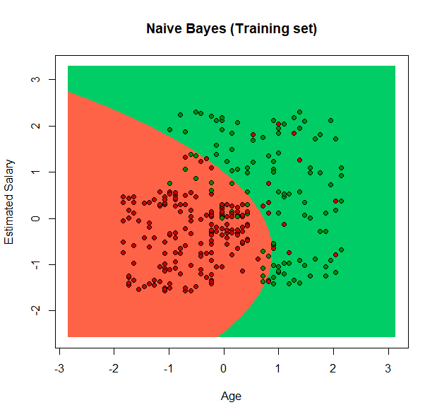
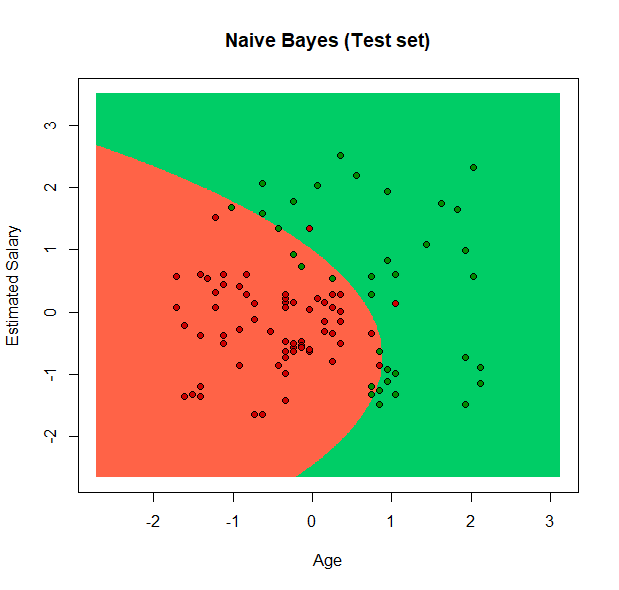
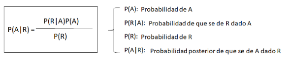

# Evaluation 3: Naive Bayes

### We get the directory we are using and then we change it and verify it changes

```r
getwd()
setwd("E:/Programas TEC/TEC/Mineria de datos/Clone/DataMining/MachineLearning")
getwd()
```

### We import the dataset

```r
dataset <- read.csv('Social_Network_Ads.csv')
dataset <- dataset[, 3:5]
```

### We encode the data from the column Purchased

```r
dataset$Purchased = factor(dataset$Purchased, levels = c(0, 1))
```

### Import the library caTools and split the the dataset into training and testing set .75 and .25 respectively

```r
library(caTools)
split <- sample.split(dataset$Purchased, SplitRatio = 0.75)
training_set <- subset(dataset, split == TRUE)
test_set <- subset(dataset, split == FALSE)
```

### Scale the third column so it normalize the data, so it's more accurate when we use the predictive algorithm

```r
training_set[-3] = scale(training_set[-3])
test_set[-3] = scale(test_set[-3])
```

### We import the library e1071 and implemente the function naiveBayes where the independent values X are the third column of the training set and Y is the trainingset where we will try the prediction

```r
library(e1071)
classifier = naiveBayes(x = training_set[-3], y = training_set$Purchased)
```

### Classify the testset, and specify the prediction to the third column

```r
y_pred = predict(classifier, newdata = test_set[-3])
y_pred
```

Result:

```r
> y_pred
  [1] 0 0 0 0 1 1 0 0 0 0 0 0 0 1 0 0 0 0 0 0 0 0 0 0 0 0 0 0 0 0 0 0 0 0 0 0 0 1 0 0 0 0 0 0 0 0 0 0 0 0 1 1 1 1
 [55] 0 1 0 1 1 1 1 0 1 0 0 0 1 1 0 1 0 0 1 0 0 0 0 0 1 0 0 0 0 1 0 0 1 0 0 1 1 0 0 1 1 1 1 1 1 1
Levels: 0 1

```

### Apply the confusion table, where we evaluate the precision of the test

The last step before seeing the plotted result is to make a confusion matrix. This aims to evaluate how accurate the prediction made in the previous step was. In this, the false positives and false negatives are added, thus obtaining the error percentage, that is, erroneous predictions made by the algorithm saying that a data was true or false when it was not.

```r
cm = table(test_set[, 3], y_pred)
cm
```

Result:

```r
> cm = table(test_set[, 3], y_pred)
> cm
   y_pred
     0  1
  0 62  2
  1  8 28
```

### Visualize the training set using the library ElemStatLearn

```r
library(ElemStatLearn)
set = training_set
X1 = seq(min(set[, 1]) - 1, max(set[, 1]) + 1, by = 0.01)
X2 = seq(min(set[, 2]) - 1, max(set[, 2]) + 1, by = 0.01)
grid_set = expand.grid(X1, X2)
colnames(grid_set) = c('Age', 'EstimatedSalary')
y_grid = predict(classifier, newdata = grid_set)
plot(set[, -3],
     main = 'Naive Bayes (Training set)',
     xlab = 'Age', ylab = 'Estimated Salary',
     xlim = range(X1), ylim = range(X2))
contour(X1, X2, matrix(as.numeric(y_grid), length(X1), length(X2)), add = TRUE)
points(grid_set, pch = '.', col = ifelse(y_grid == 1, 'springgreen3', 'tomato'))
points(set, pch = 21, bg = ifelse(set[, 3] == 1, 'green4', 'red3'))
```

Result:

#### We can see the results where every 0.01 is represented by a point red or green the values used where X=Age and Y= Estimated Salary the implemented values are the classified data where is delimited by the colour and the dots are the real data and the background the prediction

It is shown that the older the age and the purchasing power, the more likely they are to make the purchase through the advertisement, otherwise if they are young and have no resources they will not make the purchase, which makes sense in general contexts.



### Visualize the testing set using the ElemStatLearn

```r
library(ElemStatLearn)
set = test_set
X1 = seq(min(set[, 1]) - 1, max(set[, 1]) + 1, by = 0.01)
X2 = seq(min(set[, 2]) - 1, max(set[, 2]) + 1, by = 0.01)
grid_set = expand.grid(X1, X2)
colnames(grid_set) = c('Age', 'EstimatedSalary')
y_grid = predict(classifier, newdata = grid_set)
plot(set[, -3], main = 'Naive Bayes (Test set)',
     xlab = 'Age', ylab = 'Estimated Salary',
     xlim = range(X1), ylim = range(X2))
contour(X1, X2, matrix(as.numeric(y_grid), length(X1), length(X2)), add = TRUE)
points(grid_set, pch = '.', col = ifelse(y_grid == 1, 'springgreen3', 'tomato'))
points(set, pch = 21, bg = ifelse(set[, 3] == 1, 'green4', 'red3'))
```

Result:

#### Very similar to the other result but we are visualizing the test set



### Explication: Naive Bayes classification model

In a broad sense, Naive Bayes models are a special class of classification algorithms for Machine Learning, or Machine Learning, as we will refer to from now on. They are based on a statistical classification technique called "Bayes's theorem."

These models are called "Naive" algorithms, or "Innocents" in Spanish. They assume that the predictor variables are independent of each other. In other words, that the presence of a certain feature in a data set is not at all related to the presence of any other feature.
They provide an easy way to build very well behaved models due to their simplicity.

They do this by providing a way to calculate the 'later' probability of a certain event A occurring, given some 'earlier' event probabilities.


