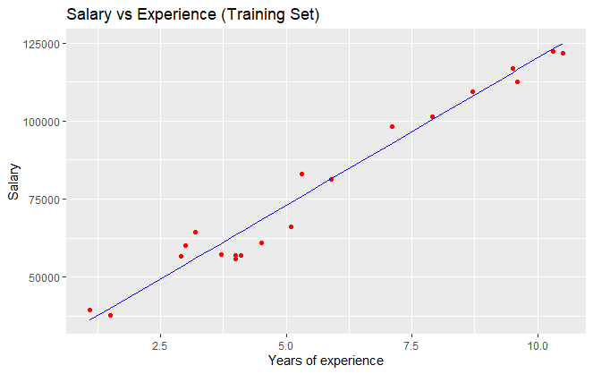
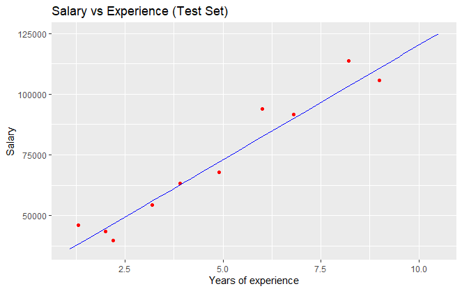

# Practice 1 Simple Linear Regression

In this practice we will show an example of the implementation of the simple linear regression, a machine learning model, first we have the reading of the dataset to use where the path is specified and once the dataset is identified, it is read with the "Read" method being attached to a variable in R.

We already had the path at downloads

```r
getwd()
setwd("../MachineLearning/SimpleLinearRegression")
getwd()
```

#### Importing the dataset

We import the dataset into a variable.

```r
dataset <- read.csv('Salary_Data.csv')
```

#### Splitting the dataset into the Training set and Test set

#### Install.packages('caTools')

Next, the dataset is divided to have its respective sample for training and testing, for this it is necessary to install the “calTools” library that contains several methods to speed up the splitting of the data.

Remember to Install it before importing it

```r
library(caTools)
```

The randomness number is specified when dividing the data, then the type of the dataset field to be used and the division percentage for training and testing is specified. Ending with two new variables that contain the training and test data.

1. We set the seed to 123

```r
set.seed(123)
```

2. Then we split the salary sample

```r
split <- sample.split(dataset$Salary, SplitRatio = 2/3)
```

3. We train the dataset with split TRUE

```r
training_set <- subset(dataset, split == TRUE)
```

4. We train the dataset with split FALSE

```r
test_set <- subset(dataset, split == FALSE)
```

#### Fitting Simple Linear Regression to the Training set

lm is used to fit linear models. In this case, it is specified how the salary is formulated with respect to the years of experience, using, for example, the data from the main dataset.

```r
regressor = lm(formula = Salary ~ YearsExperience,
               data = dataset)
summary(regressor)
```

Result:

```r
Residuals:
    Min      1Q  Median      3Q     Max
-7958.0 -4088.5  -459.9  3372.6 11448.0

Coefficients:
                Estimate Std. Error t value Pr(>|t|)
(Intercept)      25792.2     2273.1   11.35 5.51e-12 ***
YearsExperience   9450.0      378.8   24.95  < 2e-16 ***
---
Signif. codes:  0 ‘***’ 0.001 ‘**’ 0.01 ‘*’ 0.05 ‘.’ 0.1 ‘ ’ 1

Residual standard error: 5788 on 28 degrees of freedom
Multiple R-squared:  0.957,	Adjusted R-squared:  0.9554
F-statistic: 622.5 on 1 and 28 DF,  p-value: < 2.2e-16
```

#### Predicting the Test set results

```r
y_pred = predict(regressor, newdata = test_set)
```

Result:

```r
> y_pred
        2         4         5         8        11        16        20        21        24        26
 38077.15  44692.12  46582.12  56032.08  62647.05  72097.02  82491.97  90051.94 103281.89 110841.86
```

#### Visualising the Training set results

We do a simple plot where we show the salary in comparison of the experience with the trainedset

We finish with the explanation of the training and test data visualization. Using the “ggplot2” library, the position of the generated red points is specified by specifying the value of “YearsExperience” as the axis of the “X” and for the “Y” the value of “Salary”, both from the training dataset. .
To show the simple linear regression line, the geom_line method is used where the value of "YearsExperience" from the training dataset is specified on the axis of the "X" and for the case of the "Y" the prediction generated from the Regression value obtained and the data of the test dataset and we end with the choice of the color in blue of the line, as well as the titles of the header and their respective variables "x" and "y".

```r
library(ggplot2)
ggplot() +
  geom_point(aes(x=training_set$YearsExperience, y=training_set$Salary),
             color = 'red') +
  geom_line(aes(x = training_set$YearsExperience, y = predict(regressor, newdata = training_set)),
            color = 'blue') +
  ggtitle('Salary vs Experience (Training Set)') +
  xlab('Years of experience') +
  ylab('Salary')
```



#### Visualising the Test set results

We do a simple plot where we show the salary in comparison of the experience with the testset.

In a similar way now with the test data we proceed to the explanation of the display of the test data. Using the "ggplot2" library, the position of the red points generated is specified by specifying as the "X" axis the value of "YearsExperience" and for the "Y" the value of "Salary", both from the test dataset. .
To show the simple linear regression line, the geom_line method is used where the value of "YearsExperience" from the training dataset is specified on the axis of the "X" and for the case of the "Y" the prediction generated from the Regression value obtained and the data from the training dataset and we finish with the choice of the color in blue of the line, as well as the titles of the header and their respective variables "x" and "y".

```r
ggplot() +
  geom_point(aes(x=test_set$YearsExperience, y=test_set$Salary),
             color = 'red') +
  geom_line(aes(x = training_set$YearsExperience, y = predict(regressor, newdata = training_set)),
            color = 'blue') +
  ggtitle('Salary vs Experience (Test Set)') +
  xlab('Years of experience') +
  ylab('Salary')
```


