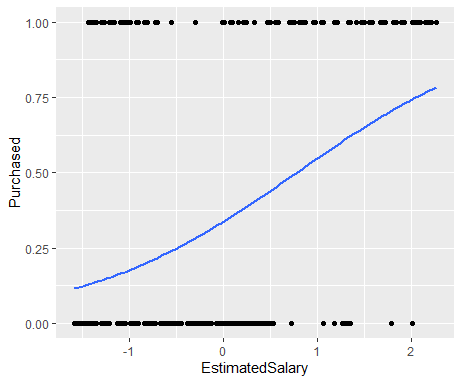
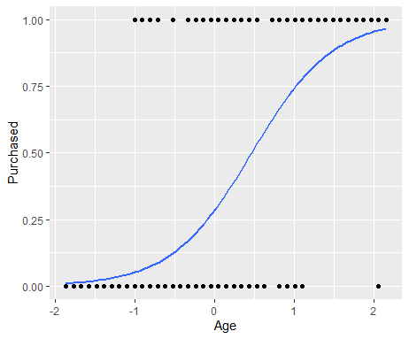
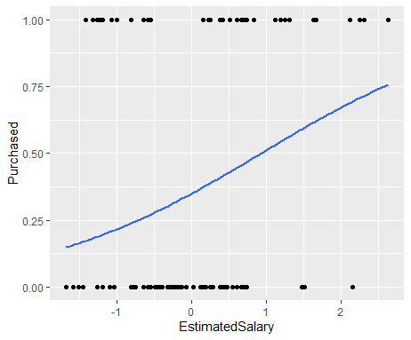
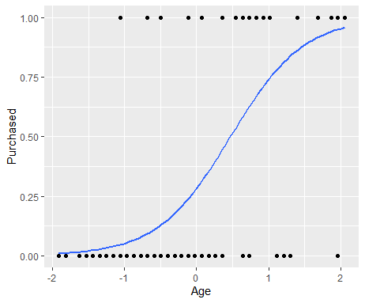
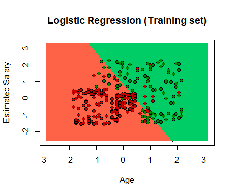
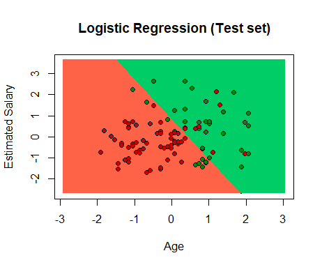

# Practice 3 Simple Logistic Regression

In this practice, an example of logistic regression will be carried out, first we need to import the dataset.

```r
getwd()
setwd("../LogisticRegression")
getwd()
```

The data will be stored in a variable using the “read” method, to have a better use of the data it is necessary to select only the “Age, Estimated Salary and Purchased” fields.

```r
# Importing the dataset
dataset <- read.csv('Social_Network_Ads.csv')
dataset <- dataset[, 3:5]
```

To perform the division of the dataset for training and testing we use the "caTools" library, specifying the randomness coefficient as 123. The data will be divided into a 75% margin for training and the remainder for testing, each percentage of dataset will have its own independent variable.

```r
# Splitting the dataset into the Training set and Test set
# Install.packages('caTools')
library(caTools)
set.seed(123)
split <- sample.split(dataset$Purchased, SplitRatio = 0.75)
training_set <- subset(dataset, split == TRUE)
test_set <- subset(dataset, split == FALSE)
```

We scale the training and test data to perform better on predictions.

```r
# Feature scaling
training_set[, 1:2] <- scale(training_set[, 1:2])
test_set[, 1:2] <- scale(test_set[, 1:2])
```

Adaptation of the logistic regression to the training set, we define a new classification variable, where we take as a parameter the “Purchased” formula with respect to the other fields and the results are defined as binomial, this when using the training dataset.

```r
# Fitting Logistic Regression to Training set
classifier = glm(formula = Purchased ~ .,
                 family = binomial,
                 data = training_set)
```

By having the variable with the classification values, we can now do a prediction test where the test dataset, which is type response and the variable obtained previously, are taken as parameters. With the values obtained in the prediction it is now possible to define the condition that shows if the value is greater than 0.5 it is one type of the classification and if it is not, it is the other type.

```r
# Predicting the Test set results
prob_pred = predict(classifier, type = 'response', newdata = test_set[-3])
prob_pred
y_pred = ifelse(prob_pred > 0.5, 1, 0)
y_pred
```

Result:

```r
> prob_pred
           2            4            5            9           12           18           19           20           22           29           32
0.0162395375 0.0117148379 0.0037846461 0.0024527456 0.0073339436 0.2061576580 0.2669935073 0.3851475689 0.5448578778 0.0103005636 0.2994922143
          34           35           38           45           46           48           52           66           69           74           75
0.0084168787 0.0494471952 0.0171641479 0.0485051303 0.0008343060 0.0102561619 0.0007055347 0.0058448457 0.0044534947 0.3933468488 0.0071065671
          82           84           85           86           87           89          103          104          107          108          109
0.1068589185 0.2580084947 0.0303248927 0.3303649169 0.0051132916 0.0263861849 0.1310148056 0.7649772313 0.0034367786 0.0473827096 0.0327965105
         117          124          126          127          131          134          139          148          154          156          159
0.1626049288 0.0675494054 0.2189658514 0.4142562486 0.0324337750 0.0043457839 0.0163538708 0.1030590600 0.0751093248 0.0048556976 0.0027487256
         162          163          170          175          176          193          199          200          208          213          224
0.0306647902 0.0463555716 0.0122981409 0.1169016711 0.0011936610 0.0103005636 0.0252589417 0.0177353905 0.9870859806 0.9453359968 0.9969454446
         226          228          229          230          234          236          237          239          241          255          264
0.1064430571 0.9979393884 0.3705093415 0.5807527959 0.9117762840 0.7817273411 0.2310672929 0.8037996043 0.9682706714 0.6686007827 0.1451169281
         265          266          273          274          281          286          292          299          302          305          307
0.9060311409 0.8293112410 0.9568520348 0.6781064291 0.9926955397 0.4170486388 0.9220096987 0.7363498859 0.8247736816 0.2558136823 0.9932007105
         310          316          324          326          332          339          341          343          347          353          363
0.1178058928 0.3442845494 0.3958138650 0.3059412440 0.9725035550 0.1431602303 0.9842795480 0.2073273008 0.9371909698 0.6843940060 0.5559479117
         364          367          368          369          372          373          380          383          389          392          395
0.5698028861 0.9440512240 0.8427877409 0.2549836305 0.9928717092 0.3243409327 0.8519685008 0.9697473704 0.3793408625 0.2718336775 0.2040229226
         400
0.5236436275
> y_pred = ifelse(prob_pred > 0.5, 1, 0)
> y_pred
  2   4   5   9  12  18  19  20  22  29  32  34  35  38  45  46  48  52  66  69  74  75  82  84  85  86  87  89 103 104 107 108 109 117 124 126
  0   0   0   0   0   0   0   0   1   0   0   0   0   0   0   0   0   0   0   0   0   0   0   0   0   0   0   0   0   1   0   0   0   0   0   0
127 131 134 139 148 154 156 159 162 163 170 175 176 193 199 200 208 213 224 226 228 229 230 234 236 237 239 241 255 264 265 266 273 274 281 286
  0   0   0   0   0   0   0   0   0   0   0   0   0   0   0   0   1   1   1   0   1   0   1   1   1   0   1   1   1   0   1   1   1   1   1   0
292 299 302 305 307 310 316 324 326 332 339 341 343 347 353 363 364 367 368 369 372 373 380 383 389 392 395 400
  1   1   1   0   1   0   0   0   0   1   0   1   0   1   1   1   1   1   1   0   1   0   1   1   0   0   0   1
```

```r
# Making the Confusion Metrix
cm = table(test_set[, 3], y_pred)
cm
```

Result:

```r
> cm
   y_pred
     0  1
  0 57  7
  1 10 26
```

The following graphs show the linear model of the relationship of the “Purchased” with all the other fields of the dataset.

```r
library(ggplot2)
ggplot(training_set, aes(x=EstimatedSalary, y=Purchased)) + geom_point() +
  stat_smooth(method="glm", method.args=list(family="binomial"), se=FALSE)
```



```r
ggplot(training_set, aes(x=Age, y=Purchased)) + geom_point() +
  stat_smooth(method="glm", method.args=list(family="binomial"), se=FALSE)
```



```r
ggplot(test_set, aes(x=EstimatedSalary, y=Purchased)) + geom_point() +
  stat_smooth(method="glm", method.args=list(family="binomial"), se=FALSE)
```



```r
ggplot(test_set, aes(x=Age, y=Purchased)) + geom_point() +
  stat_smooth(method="glm", method.args=list(family="binomial"), se=FALSE)
```



Finally we will show a graph using the "ElemStatLearn" library that allows a better visualization of the logistic regression model with the training data.

1. We import the library
2. In a new variable we define the data of the training dataset
3. We create 2 new variables with the transformation of the values ​​of the “Age” field for “X1” and the “Estimated Salary” field for “X2”
4. We create a “Grid_set” data frame from all the combinations of the vectors or factors provided previously
5. The names of the fields are changed to their previous ones
6. We generate a new variable "prob, set" for the prediction, which is performed with the training dataset, and the value of "Classifier" obtained previously and with another variable we show the values ​​as categorical with the use of a condition
7. We start the visualization of the data, defining the main name as well as the X axis and the Y axis, marking the limits of both with the values ​​obtained from the variables X1 and X2
8. We add a contour line to the existing graph, using the "contour" method with the parameters of the sequences X1 and X2, as well as the values ​​obtained in the prediction "y_grid"
9. Ending with the "points" methods that allow to make a change in the design of the graph to visually show the separation of the categories by sections and the points as such in different colors

```r
# Visualising the Training set results
library(ElemStatLearn)
set = training_set
X1 = seq(min(set[, 1]) - 1, max(set[, 1]) + 1, by = 0.01)
X2 = seq(min(set[, 2]) - 1, max(set[, 2]) + 1, by = 0.01)
grid_set = expand.grid(X1, X2)
colnames(grid_set) = c('Age', 'EstimatedSalary')
prob_set = predict(classifier, type = 'response', newdata = grid_set)
y_grid = ifelse(prob_set > 0.5, 1, 0)
plot(set[, -3],
     main = 'Logistic Regression (Training set)',
     xlab = 'Age', ylab = 'Estimated Salary',
     xlim = range(X1), ylim = range(X2))
contour(X1, X2, matrix(as.numeric(y_grid), length(X1), length(X2)), add = TRUE)
points(grid_set, pch = '.', col = ifelse(y_grid == 1, 'springgreen3', 'tomato'))
points(set, pch = 21, bg = ifelse(set[, 3] == 1, 'green4', 'red3'))
```



Similarly for the test dataset we use the "ElemStatLearn" library that allows a better visualization of the logistic regression model with the test data.

1. We import the library
2. In a new variable we define the data of the test dataset
3. We create 2 new variables with the transformation of the values ​​of the “Age” field for “X1” and the “Estimated Salary” field for “X2”
4. We create a “Grid_set” data frame from all the combinations of the vectors or factors provided previously
5. The names of the fields are changed to their previous ones
6. We generate a new variable "prob, set" for the prediction, which is performed with the training dataset, and the value of "Classifier" obtained previously and with another variable we show the values ​​as categorical with the use of a condition
7. We start the visualization of the data, defining the main name as well as the X axis and the Y axis, marking the limits of both with the values ​​obtained from the variables X1 and X2
8. We add a contour line to the existing graph, using the "contour" method with the parameters of the sequences X1 and X2, as well as the values ​​obtained in the prediction "y_grid"
9. Ending with the "points" methods that allow to make a change in the design of the graph to visually show the separation of the categories by sections and the points as such in different colors

```r
# Visualising the Test set results
library(ElemStatLearn)
set = test_set
X1 = seq(min(set[, 1]) - 1, max(set[, 1]) + 1, by = 0.01)
X2 = seq(min(set[, 2]) - 1, max(set[, 2]) + 1, by = 0.01)
grid_set = expand.grid(X1, X2)
colnames(grid_set) = c('Age', 'EstimatedSalary')
prob_set = predict(classifier, type = 'response', newdata = grid_set)
y_grid = ifelse(prob_set > 0.5, 1, 0)
plot(set[, -3],
     main = 'Logistic Regression (Test set)',
     xlab = 'Age', ylab = 'Estimated Salary',
     xlim = range(X1), ylim = range(X2))
contour(X1, X2, matrix(as.numeric(y_grid), length(X1), length(X2)), add = TRUE)
points(grid_set, pch = '.', col = ifelse(y_grid == 1, 'springgreen3', 'tomato'))
points(set, pch = 21, bg = ifelse(set[, 3] == 1, 'green4', 'red3'))
```


