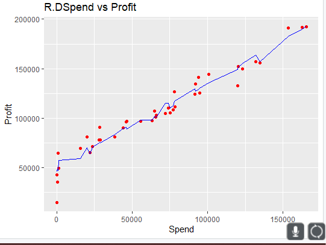
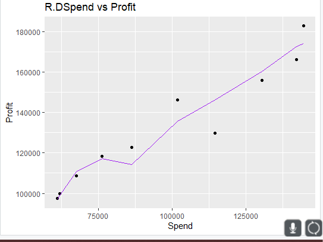

# Practice 2 Multiple Linear Regression

In this practice we will show an example of the implementation of multiple linear regression, a machine learning model, first we have the reading of the dataset to use where the path is specified and once the dataset is identified, it is read with the read.cv method being attached to a variable in R.

```r
getwd()
setwd("../MachineLearning/SimpleLinearRegression")
getwd()
```

### Importing the dataset

```r
dataset <- read.csv('50_Startups.csv')
```

### Encoding categorical data

Coding of categorical data as converting them to 1, 2 and 3 respectively.

```r
dataset$State = factor(dataset$State,
                       levels = c('New York', 'California', 'Florida'),
                       labels = c(1,2,3))
```

### Show dataset

```r
dataset
```

Result:

```r
> dataset
   R.D.Spend Administration Marketing.Spend State    Profit
1  165349.20      136897.80       471784.10     1 192261.83
2  162597.70      151377.59       443898.53     2 191792.06
3  153441.51      101145.55       407934.54     3 191050.39
4  144372.41      118671.85       383199.62     1 182901.99
5  142107.34       91391.77       366168.42     3 166187.94
6  131876.90       99814.71       362861.36     1 156991.12
7  134615.46      147198.87       127716.82     2 156122.51
8  130298.13      145530.06       323876.68     3 155752.60
...
```

### Splitting the dataset into the Training set and Test set

### Install.packages('caTools')

Divide the data set into the training set and the test set. Using the "calTools" library, where 80% is specified for training and 20% for testing the specific dataset. Ending with two new variables with the same data.

```r
library(caTools)
set.seed(123)
split <- sample.split(dataset$Profit, SplitRatio = 0.8)
training_set <- subset(dataset, split == TRUE)
test_set <- subset(dataset, split == FALSE)
```

### Fitting Multiple Linear Regression to the Training set

### regressor = lm(formula = Profit ~ R.D.Spend + Administration + Marketing.Spend + State)

Next, the regression variable is obtained from the use of the "lm" method that is used to fit linear models, in this case with the use of the formula parameter that uses the Profit values as constants with respect to all the other variables, all relative to the training dataset.

```r
regressor = lm(formula = Profit ~ .,
               data = training_set )

summary(regressor)
```

Result:

We can observe the most significant variables where the lower “Pr (> | t |)” the lower the variable to be considered relevant to have a better prediction, for standardization purposes it is recommended that the value be less than 0.05.

```r
Residuals:
   Min     1Q Median     3Q    Max
-33128  -4865      5   6098  18065

Coefficients:
                  Estimate Std. Error t value Pr(>|t|)
(Intercept)      4.965e+04  7.637e+03   6.501 1.94e-07 ***
R.D.Spend        7.986e-01  5.604e-02  14.251 6.70e-16 ***
Administration  -2.942e-02  5.828e-02  -0.505    0.617
Marketing.Spend  3.268e-02  2.127e-02   1.537    0.134
State2           1.213e+02  3.751e+03   0.032    0.974
State3           2.376e+02  4.127e+03   0.058    0.954
---
Signif. codes:  0 ‘***’ 0.001 ‘**’ 0.01 ‘*’ 0.05 ‘.’ 0.1 ‘ ’ 1

Residual standard error: 9908 on 34 degrees of freedom
Multiple R-squared:  0.9499,	Adjusted R-squared:  0.9425
F-statistic:   129 on 5 and 34 DF,  p-value: < 2.2e-16
```

### Prediction the Test set results

Now a test is carried out for the model, this through making some predictions with the use of the variables of "Regressor" obtained previously and the test data as a dataset.

```r
y_pred = predict(regressor, newdata = test_set)
y_pred
```

```r
> y_pred
        4         5         8        11        16        20        21        24        31        32
173981.09 172655.64 160250.02 135513.90 146059.36 114151.03 117081.62 110671.31  98975.29  96867.03
```

### Assigment: visualize the simple liner regression model with R.D.Spend

### This is the plot using the trainingset

For the first visualization we show the data with respect to the training dataset, to plot the points we use the “R.D.Spend” variable as “X” and the “Profit” variable as “Y”, defining red as the color. For the visualization of the line we define the “X” for the variable “R.D.Spend” and “Y” the value generated by the prediction of “Regressor” and the training data, shown in blue color, ending with the definition of the titles.

```r
library(ggplot2)
ggplot() +
  geom_point(aes(x=training_set$R.D.Spend, y=training_set$Profit),
             color = 'red') +
  geom_line(aes(x = training_set$R.D.Spend, y = predict(regressor, newdata = training_set)),
            color = 'blue') +
  ggtitle('R.DSpend vs Profit') +
  xlab('Spend') +
  ylab('Profit')
```



### This is the plot using the testset

In the same way, for the test data, it is necessary to plot the points using the “R.D.Spend” variable as “X” and the “Profit” variable as “Y”, defining black as the color. For the visualization of the line we define the "X" for the variable "R.D.Spend" and "Y" the value generated by the prediction of "Regressor" and the test data, shown in purple, ending with the definition of the titles.

```r
ggplot() +
  geom_point(aes(x=test_set$R.D.Spend, y=test_set$Profit),
             color = 'black') +
  geom_line(aes(x = test_set$R.D.Spend, y = predict(regressor, newdata = test_set)),
            color = 'purple') +
  ggtitle('R.DSpend vs Profit') +
  xlab('Spend') +
  ylab('Profit')
```



### Building the optimal model using Backward Elimination

The following code shows an example of how eliminating the least significant variables one by one shows better results. Until you have the ideal set that meets the aforementioned conditions.

```r
regressor = lm(formula = Profit ~ R.D.Spend + Administration + Marketing.Spend + State,
               data = dataset )
summary(regressor)

regressor = lm(formula = Profit ~ R.D.Spend + Administration + Marketing.Spend,
               data = dataset )
summary(regressor)

regressor = lm(formula = Profit ~ R.D.Spend + Marketing.Spend,
               data = dataset )
summary(regressor)

regressor = lm(formula = Profit ~ R.D.Spend + Marketing.Spend,
               data = dataset )
summary(regressor)

y_pred = predict(regressor, newdata = test_set)
y_pred
```

Result of the significance of the values and how the prediction result is closer to what was expected.

```r
Coefficients:
                 Estimate Std. Error t value Pr(>|t|)
(Intercept)     4.698e+04  2.690e+03  17.464   <2e-16 ***
R.D.Spend       7.966e-01  4.135e-02  19.266   <2e-16 ***
Marketing.Spend 2.991e-02  1.552e-02   1.927     0.06 .
---
Signif. codes:  0 ‘***’ 0.001 ‘**’ 0.01 ‘*’ 0.05 ‘.’ 0.1 ‘ ’ 1

Residual standard error: 9161 on 47 degrees of freedom
Multiple R-squared:  0.9505,	Adjusted R-squared:  0.9483
F-statistic: 450.8 on 2 and 47 DF,  p-value: < 2.2e-16

> y_pred = predict(regressor, newdata = test_set)
> y_pred
        4         5         8        11        16        20        21        24        31        32
173441.31 171127.62 160455.74 135011.91 146032.72 115816.42 116650.89 109886.19  99085.22  98314.55
```

Homework analise the follow atomation backwardElimination function

1. It start by the declaration of backwardElimination giving the x value and sl=0.05
2. Numvars is equal to the the lenght of x
3. We iterate with the counting the numvar variable
4. Inside we have the MLR formula
5. Using maxvar to get the coeficient of the summary of regressor
6. We compare the maxvar value if its greater than sl
7. We use the backward elimination using x and j as the variables
8. A the end we return a summary of the regressor

```r
backwardElimination <- function(x, sl) {
  numVars = length(x)
  for (i in c(1:numVars)){
    regressor = lm(formula = Profit ~ ., data = x)
    maxVar = max(coef(summary(regressor))[c(2:numVars), "Pr(>|t|)"])
    if (maxVar > sl){
      j = which(coef(summary(regressor))[c(2:numVars), "Pr(>|t|)"] == maxVar)
      x = x[, -j]
    }
    numVars = numVars - 1
  }
  return(summary(regressor))
}

SL = 0.05
#dataset = dataset[, c(1,2,3,4,5)]
training_set
backwardElimination(training_set, SL)
```

It ends by showing the "Summary" of the best combination of variables for a better prediction, where in all variables a representation of an "SL" less than 0.05 is used.

```r
Call:
lm(formula = Profit ~ ., data = x)

Residuals:
   Min     1Q Median     3Q    Max
-34334  -4894   -340   6752  17147

Coefficients:
             Estimate Std. Error t value Pr(>|t|)
(Intercept) 4.902e+04  2.748e+03   17.84   <2e-16 ***
R.D.Spend   8.563e-01  3.357e-02   25.51   <2e-16 ***
---
Signif. codes:  0 ‘***’ 0.001 ‘**’ 0.01 ‘*’ 0.05 ‘.’ 0.1 ‘ ’ 1

Residual standard error: 9836 on 38 degrees of freedom
Multiple R-squared:  0.9448,	Adjusted R-squared:  0.9434
F-statistic: 650.8 on 1 and 38 DF,  p-value: < 2.2e-16
```
