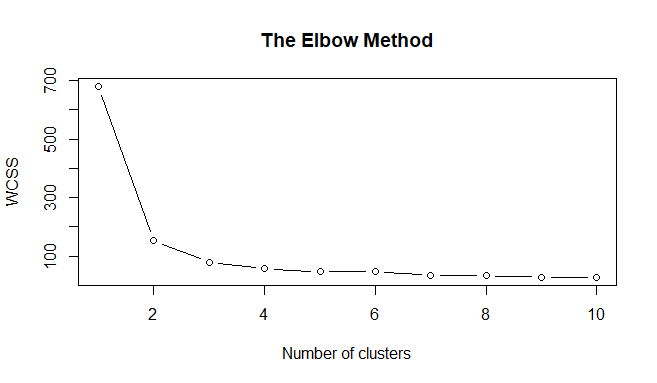
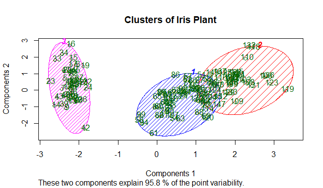

# Evaluation 4: K-means

Dataset directory change.

```r
getwd()
setwd("E:/Programas TEC/TEC/Mineria de datos/Practicas/Flores_Practicas/Unit_4/iris-master")
getwd()
```

Import and select iris dataset.

```r
dataset = read.csv('iris.csv')
```

We select all the characteristics of the irises, without the categories.

```r
dt = dataset[1:4]
dt
```

Result:

```r
> dt
    sepal_length sepal_width petal_length petal_width
1            5.1         3.5          1.4         0.2
2            4.9         3.0          1.4         0.2
3            4.7         3.2          1.3         0.2
4            4.6         3.1          1.5         0.2
5            5.0         3.6          1.4         0.2
6            5.4         3.9          1.7         0.4
7            4.6         3.4          1.4         0.3
8            5.0         3.4          1.5         0.2
9            4.4         2.9          1.4         0.2
...
```

Using the elbow method to find the optimal number of groups to use in the kmean model.

```r
TEM <- function(dataset){
  set.seed(6)
  wcss = vector()
  for (i in 1:10) wcss[i] = sum(kmeans(dataset, i)$withinss)
  plot(1:10,
       wcss,
       type = 'b',
       main = paste('The Elbow Method'),
       xlab = 'Number of clusters',
       ylab = 'WCSS')
}
```

We show the graph that shows the recommendation of possible clusters quantity.

```r
TEM(dt)
```

Result:



Fit K-Means to the data set.

```r
Clusters <- function(dataset, cnt){
  set.seed(29)
  kmeans = kmeans(x = dataset, centers = cnt)
  y_kmeans = kmeans$cluster
}
```

We create a variable of the new k-means model with the selected dataset and the number of clusters.

```r
ykmeans <- Clusters(dt, 3)
```

Visualizing the clusters.

```r
library(cluster)
clusplot(dt,
         ykmeans,
         lines = 0,
         shade = TRUE,
         color = TRUE,
         labels = 2,
         plotchar = FALSE,
         span = TRUE,
         main = paste('Clusters of Iris Plant'),
         xlab = 'Components 1',
         ylab = 'Components 2')
```

Result:


